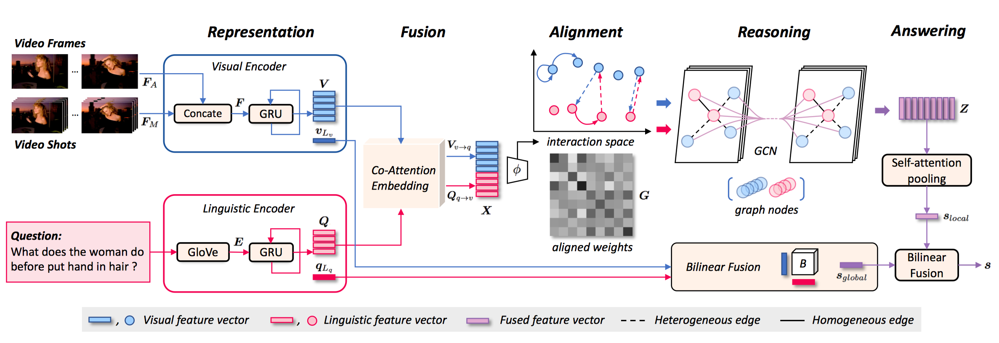

# HGA
Pytorch code of Reasoning with Heterogeneous Graph Alignment for Video Question Answering.



## Data

## Pre-trained Model
We provide four pre-trained models for TGIF-QA dataset.

## Test
The model test is carried out by loading the above pre-trained models. We provide the pre-trained models that achieve similar performance reported in the paper.

|Task of TGIF-QA|Performance|
|---|---|
|Count|4.092|
|Action|75.5|
|Trans|80.95|
|FrameQA|54.99|

```
CUDA_VISIBLE_DEVICES=0 python main.py  --test --task Count --num_workers 2 --batch_size 64
```

## Train
We give a base example of the subtask Action on TGIF-QA dataset (removing training tricks). You can modify the parameters at will on the corresponding datasets.
```
CUDA_VISIBLE_DEVICES=0 python main.py --task Action --num_workers 2 --batch_size 64 --lr 0.0001 --model 7 --dropout 0.3 --change_lr none --ablation none
```

## Cite

```
@inproceedings{jiang2020reasoning,
  title={Reasoning with Heterogeneous Graph Alignment for Video Question Answering},
  author={Jiang, Pin and Han, Yahong},
  booktitle={Proceedings of the AAAI Conference on Artificial Intelligence},
  year={2020}
}
```

